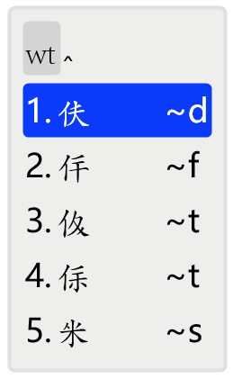

# jurchen_wubi
基于Rime的女真文五笔输入方案

A Rime-based Wubi input schema for the Jurchen Script

## 一、概述

​	本输入方案基于输入法内核Rime，提供.dict码表、.schema配置文件和.ico图标。使用时需先下载安装Rime，再挂载本方案的码表、配置文件和图标。

## 二、背景

宋辽夏金时期，各民族政权为了强调民族主体性，纷纷仿照汉字创制了民族文字，除了博主先前介绍过的契丹大小字，还有金朝的女真文。

女真文和后世的满文同属阿尔泰语系、满-通古斯语族，但前者是仿汉字、契丹字的方块字，后者是仿蒙文的粟特-回鹘式蒙文字母，分属不同的文字系统。

12世纪金朝建立后，女真人初使用契丹字。后太祖命完颜希尹以契丹大字和汉字为基础，创制女真字，称女真大字。熙宗亦仿契丹小字创制女真字，称女真小字。终金一代，女真大字与小字、汉字等一道并行于金朝境内。明朝初年，女真文在东北仍有少量使用，后期则逐渐消亡，以至于努尔哈赤改用蒙古字母创制满文。

女真字的结构笔画极像汉字，故可以完美适配五笔输入法。

目前，女真文的输入法已有[仓颉输入法、笔画输入法](http://www.ccamc.co/fonts_kht_jrc.php)。加上本五笔方案，共有三种输入方案可供用户选择。

## 三、使用步骤（Win11）

1. 下载并安装女真文字体，如[CCAMC Jurchen Kaiti](http://www.ccamc.co/fonts_kht_jrc.php)。
2. 下载[Rime输入法内核](https://rime.im/)并安装。
3. 右键Rime状态栏，选择并打开“用户文件夹”，将本项目的.yaml和.ico文件复制到该目录。
4. 右键Rime状态栏，选择“输入法设置”，并勾选“女真文五笔”。
5. 右键Rime状态栏，选择“重新部署”。
6. 按下ctrl+~，选择“女真文五笔”。
7. 正常使用。将打出字符的字体改为已安装的女真文字体，即可正常显示。

​	以上是Win11的使用步骤，其他平台的步骤类似，具体可参照Rime官方配置文档。

## 四、输入方案介绍

本输入方案基于五笔86版。末笔识别码、取末笔规则（取折还是撇）均与86版相同。

本方案支持字符共1435个。

输入演示如下图：

​	

本输入方案仅支持不加识别码的全码及全码，不考虑简码。键名字符需打全码，如

## 五、后记

​	本人是五笔爱好者，意图用五笔实现所有东亚汉字系文字的流畅输入。女真文是小众中的小众，本输入方案也不会有多少实际应用价值。但能实现爱好就足矣~

​	方案制作仓促，如有发现编码错误或其他问题，请直接联系我：matiasxebec@gmail.com。

## 支持

感谢[古今文字集成](http://www.ccamc.co/)及站长Jerry的相关信息、字体的支持！

感谢五笔输入法的开发者王永民先生。

感谢Rime输入法内核的开发者们。
